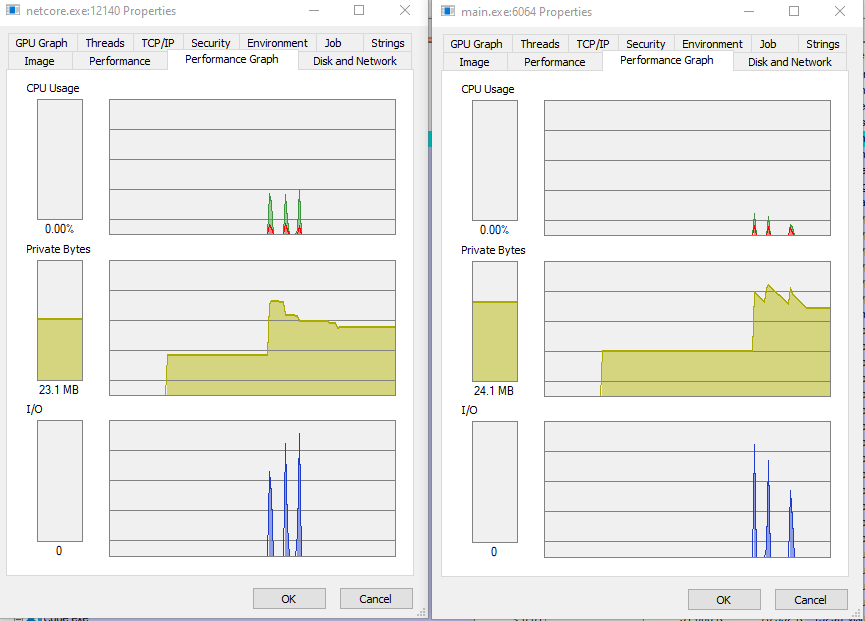

# Сравнение производительности .NET Core vs Golang 

Приложения запускались на моем ноутбуке, проверялись вызовами с удаленного компьютера (Ubuntu)

Запуск три раза:

```ab -n 10000 -c 1000 http://192.168.88.201:5000/test```

И запуск три раза:

```ab -n 10000 -c 1000 http://192.168.88.201:5002/test```

Скриншот из processexp64


netcore
~ 9300 RPS

golang
~ 10300 RPS

## Спецификации моего ноутбука

* Dell G7 7790 (17-inch)
* Windows 10 Pro 20H2
* Processor Intel Core i7-8750H
* Memory 32 GB 2666 MHz LPDDR4
* Golang go1.17.2 windows/amd64
* Dotnet 6.0
